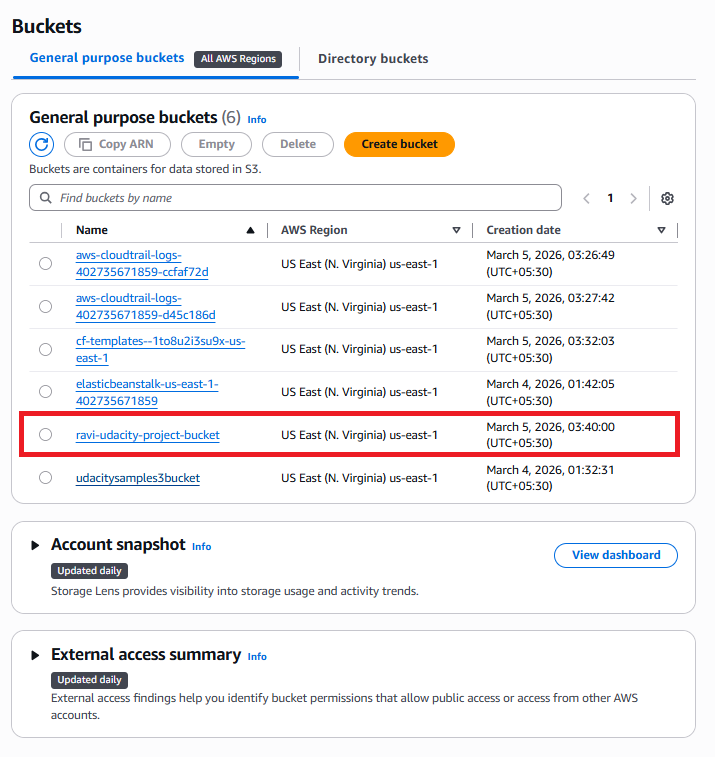
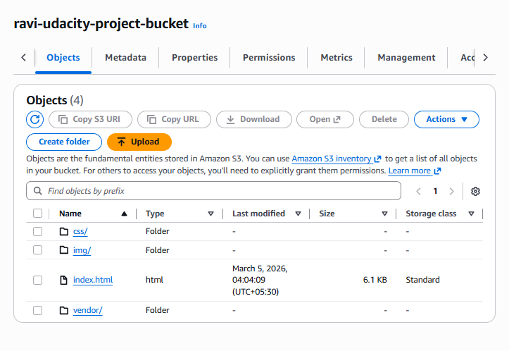
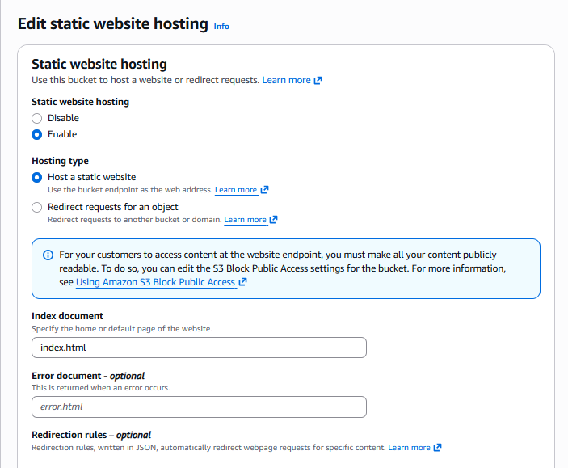
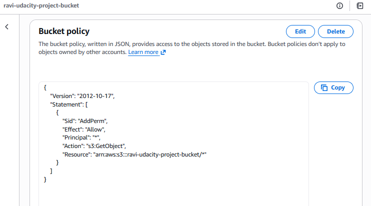
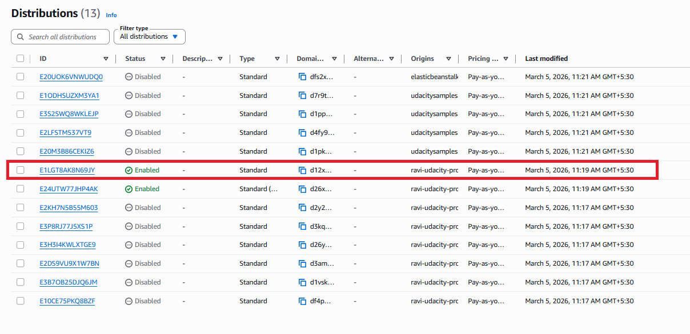

# AWS Static Website Deployment using S3 and CloudFront

This project demonstrates how to deploy a static website using **Amazon S3** and accelerate content delivery using **Amazon CloudFront CDN**.

## 📌 Project Overview

Static websites consisting of HTML, CSS, and JavaScript can be efficiently hosted using AWS S3. To improve performance and reduce latency worldwide, CloudFront is used as a Content Delivery Network (CDN).

## 🏗 Architecture

User Browser → CloudFront CDN → S3 Bucket → Static Website Files

## ⚙️ Services Used

- Amazon S3
- Amazon CloudFront
- IAM Bucket Policy
- Static Website Hosting

## 🚀 Deployment Steps

1. Created an S3 bucket to store website files
2. Uploaded static website files (HTML, CSS, JS)
3. Enabled static website hosting
4. Configured bucket policy for public access
5. Created a CloudFront distribution
6. Accessed the website via the S3 endpoint

## 🌐 Website URL

S3 Website Endpoint:

http://ravi-udacity-project-bucket.s3-website-us-east-1.amazonaws.com

## Architecture

User → CloudFront CDN → S3 Bucket → Static Website

## 📸 Project Screenshots

### S3 Bucket Creation

### Website Files Uploaded

### Static Website Hosting Enabled

### Bucket Policy Configuration

### CloudFront Distribution

### Website Running in Browser

## 🧠 Key Learning Outcomes

- Hosting static websites using Amazon S3
- Configuring S3 bucket policies
- Using CloudFront CDN for faster content delivery
- Understanding AWS storage and networking services

## 👨‍💻 Author

Ravikumar S 
Computer Science Engineering Student | ASE
